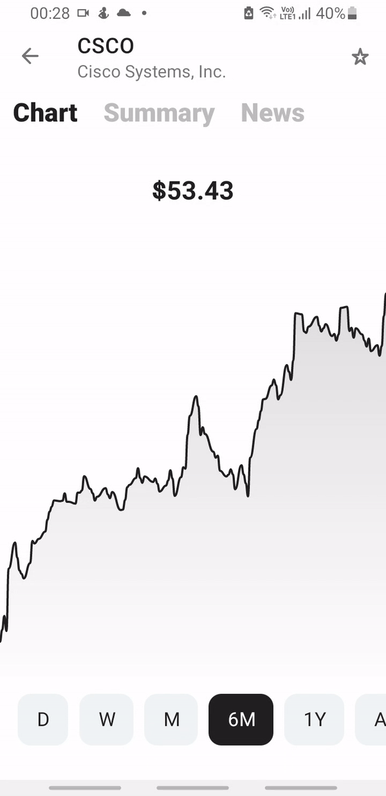
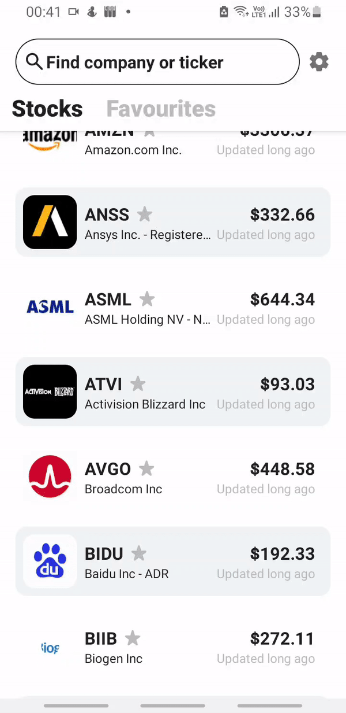

<h1>📈 StockViewer</h1>

  </img>

----------------------------------------------------------------

This application allows users to analyze stock prices and find latest market news

## Technologies and architecture
* Built on MVVM pattern 
* Uses [Dagger 2](https://github.com/google/dagger) for dependency injection
* Android Architecture Components: ViewModel, Room, Paging
* [Retrofit](https://github.com/square/retrofit) for API calls
* [Koil](https://github.com/coil-kt/coil) for image loading

## Features 
* Discover stock prices (represented as a list)
* Search for tickers
* Add tickers to favourites 
* View stock price chart for specified time segment (Day, Week, Month, Year)
* View company profile and news
* Caches list of stock prices into database

## Screenshots
 

## Plans
* Use websockets to provide users with instant updates of stock prices
* Migrate to Jetpack Compose